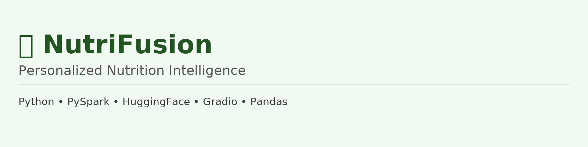

 🥦 NutriFusion: Personalized Nutrition Intelligence




NutriFusion is a **health-aware nutrition recommendation system** that personalizes dietary suggestions based on a user’s **age** and **medical condition**.
It leverages **big data pipelines**, **NLP**, and **LLMs** to provide ingredient-level analysis, highlight nutrient gaps, and suggest healthy modifications — while controlling for AI hallucinations.

---

## 📂 Project Structure

```
NutriFusion/
├── assets/                   # Banner + Architecture images
├── data/
│   ├── raw/                  # Original scraped datasets (Edamam, OpenFoodFacts, etc.)
│   └── cleaned/              # PySpark-cleaned datasets (recipes, nutrients, age-health norms)
│
├── src/
│   ├── scrapers/             # Web scraping scripts
│   ├── preprocessor/         # Data cleaning, merging (PySpark on Dataproc)
│   ├── nlp_extractor/        # NLP-based ingredient extraction
│   ├── nutrient_analyzer/    # Nutrient gap calculation
│   └── recommender/          # LLM + FAISS recommendation engine
│
├── ui/                       # Gradio-based user interface
├── tests/                    # Unit/integration tests
├── reports/                  # Milestone docs, logs, diagrams
├── sonar/                    # SonarQube configuration & results
├── requirements.txt
└── README.md
```

---

## 🧠 System Architecture


---

 🔄 Workflow Overview

1️⃣ Data Preparation

* Scraping from Edamam, OpenFoodFacts
* Cleaning & merging datasets using PySpark on Google Cloud Dataproc
* Ingredient normalization & nutrient ratio computation

2️⃣ Ingredient Extraction

spaCy + Regex for parsing and cleaning recipe ingredients
Optional HuggingFace NER model for improved accuracy

3️⃣ Nutrient Gap Analysis

* Compare nutrients to age- and disease-specific goals
* Identify deficiencies & excesses

4️⃣ Recommendation Engine

  FAISS for semantic retrieval of similar recipes
  Mistral-7B-Instruct-v0.1 for ingredient swap suggestions
  Strict rules to prevent hallucinations
  Cleanlab-TLM trust score validation

5️⃣ User Interface

  Gradio app for interactive recipe review
  Outputs modified ingredient list + nutritionist explanation

---

⚙️ Installation & Setup

```bash
# Clone the repository
git clone https://github.com/LCM-S25-3035/NutriFusion.git
cd NutriFusion

# Install dependencies
pip install -r requirements.txt

# (Optional) Run scrapers
python src/scrapers/scrape_edamam.py

# Preprocess datasets with PySpark
python src/preprocessor/clean_merge.py
```

---

🚀 Running the Gradio App

```bash
python mistral_7b_gradio_.py
```

* Loads cleaned datasets
* Runs FAISS + Mistral-7B recommendation
* Launches Gradio interface with public share link

---

 💻 Usage Example

**Input**:

```
Dish Name: Butter Chicken
Age: 30
Health Condition: Diabetes
```

**Output**:

```
✅ Modified Ingredient List:
chicken, onion, garlic, ginger, tomato puree, olive oil, spinach, cinnamon, turmeric, broccoli, kale, bell peppers, mushrooms, zucchini, flaxseeds, chia seeds, whole grain pasta

📋 Nutritionist Explanation:
The original recipe for butter chicken has been modified to reduce ingredients like cream and butter, which can impact blood sugar levels for someone with diabetes. In their place, nutrient-rich additions such as spinach, turmeric, and flaxseeds have been incorporated to increase fiber and support blood sugar stability. These changes make the dish healthier while maintaining its flavor profile, ensuring it is better suited for a 30-year-old managing diabetes.
```

---

 📦 Tech Stack

* Big Data: PySpark (Google Cloud Dataproc)
* NLP: spaCy, Regex, HuggingFace Transformers
* AI: SentenceTransformers, FAISS, Mistral-7B, Cleanlab-TLM
* Frontend: Gradio
* Data Processing: Pandas, NumPy
* Code Quality: SonarQube

---

 ✅ Current Progress

✔ Data scraping & cleaning (Edamam, OpenFoodFacts)
✔ PySpark-based preprocessing on Dataproc
✔ FAISS + Mistral-7B recommendation pipeline
✔ Gradio interface deployment
✔ Hallucination control with Cleanlab-TLM

---

 🔭 Future Goals

* Real-time recipe scoring via Kafka/RisingWave
* Fine-tuned Mistral-7B for food/nutrition domain
* API endpoints for meal planning apps
* Wearable device integration for real-time health tracking

---

 💡 Vision

To empower healthier food choices through data-driven personalization, transforming everyday recipes into meals optimized for your **age**, **medical needs**, and **nutritional goals**.

---

